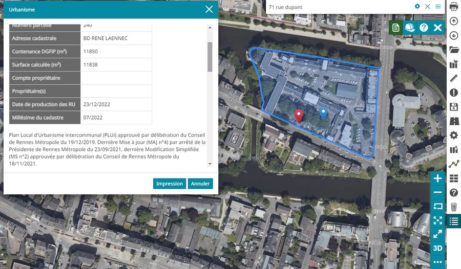

# Description

## Affichage de la note de renseignement d'urbanisme (NRU)
 Un clic sur la parcelle cadastrale permet d'afficher la fiche descriptive des renseignements d'urbanisme de cette parcelle

## Affichage de la liste des dossiers droits du sol (ADS)
 Un clic sur la parcelle cadastrale permet d'afficher la liste des dossiers de droit des sols associés à cette parcelle

